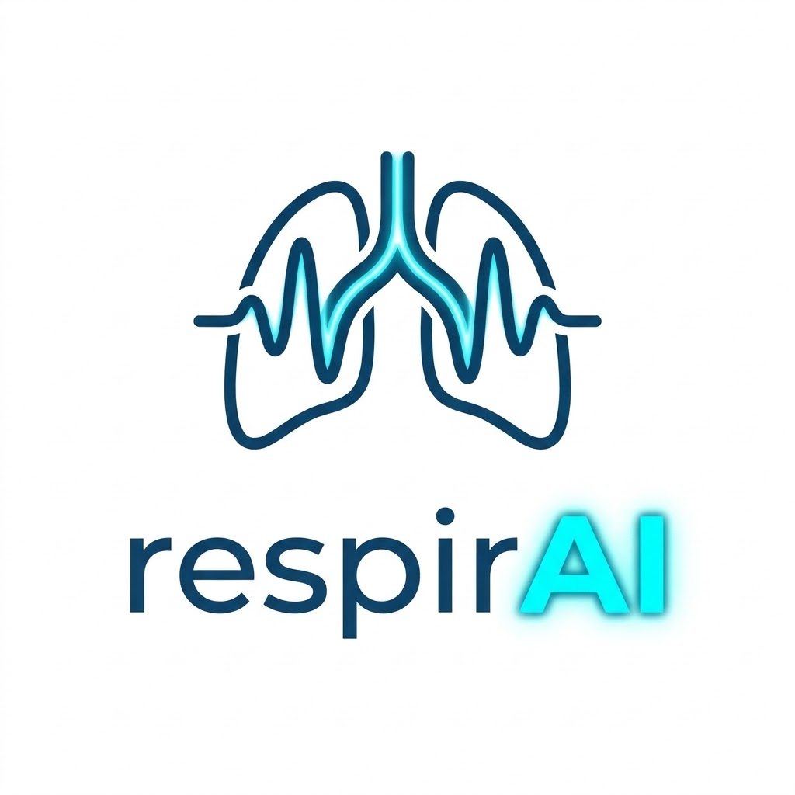
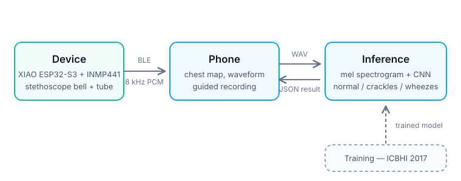

<p align="center">
  
</p>

<p align="center"><b>A stethoscope that understands what it hears.</b></p>

<p align="center">
  Your phone shows you where to place it and when to breathe. The device listens,
  an AI reads the sounds, and seconds later you know whether your lungs sound normal
  — or whether it's time to see a doctor.
</p>

---

## Status

Pre-build. Hardware is on order and the software is being written for the **Medical Renaissance** hackathon in Timișoara.

| Part | State |
|---|---|
| Architecture + interface contracts | Defined |
| Firmware (ESP32, I²S + BLE) | Not started |
| Web app (Web Bluetooth) | Not started |
| AI model (ICBHI) | Not started |
| Enclosure (CAD) | Not started |

## What it does

The stethoscope has barely changed since Laennec invented it in 1816, and interpreting what it hears still takes a trained ear.

respirAI streams lung sounds over Bluetooth to the patient's phone. The phone shows a torso diagram marking where to place the device, while a light pattern on the device itself guides the breathing rhythm. A neural network then screens each recording for **crackles** and **wheezes** and reports whether the lungs sound normal — no clinical training required.

## How it works

<p align="center">
  
</p>

The device captures audio at 16 kHz, downsamples to 8 kHz and streams 10 ms packets over Bluetooth Low Energy. The phone reassembles them, guides the user through the seven ICBHI chest positions, and sends each recording for inference. Results come back as JSON and are shown per position.

## Hardware

| Part | Purpose |
|---|---|
| Seeed XIAO ESP32-S3 | MCU, Bluetooth, battery charging |
| INMP441 | I²S MEMS microphone |
| Stethoscope chest piece + tube | acoustic front end |
| LiPo 3.7 V 2500 mAh | power |
| WS2812B 8×8 matrix | breathing guide |

All off-the-shelf parts, no custom PCB.

### Planned add-ons

The same platform — power, sensor bus and app pipeline — is designed to take extension modules:

| Add-on | Purpose |
|---|---|
| AD8232 | single-lead ECG |
| MAX30102 | pulse and SpO2 |

See [`docs/ADDONS.md`](docs/ADDONS.md).

## Repository structure

```
firmware/   ESP32 — I²S capture, downsampling, BLE service
app/        web app — Web Bluetooth, guided recording, results
ai/         training notebook, preprocessing, inference server
cad/        enclosure models and print files
docs/       architecture, plan, interface contracts
```

| Document | What's in it |
|---|---|
| [`docs/PLAN.md`](docs/PLAN.md) | full project plan: scope, hardware, wiring, tasks, timeline, risks |
| [`docs/ARCHITECTURE.md`](docs/ARCHITECTURE.md) | the three interface contracts, byte by byte |
| [`docs/ENCLOSURE.md`](docs/ENCLOSURE.md) | mechanical design manual for the 3D-printed case |
| [`docs/ADDONS.md`](docs/ADDONS.md) | ECG and pulse extension modules |

## Interface contracts

The three interfaces are frozen so each part can be built independently. Full details in [`docs/ARCHITECTURE.md`](docs/ARCHITECTURE.md).

- **Firmware ↔ App** — BLE service `7b8c9d00-0001-4b5e-8f00-1a2b3c4d5e6f`, 162-byte packets (2-byte sequence + 10 ms of 8 kHz 16-bit mono PCM)
- **App ↔ AI** — `POST /analyze` with a WAV and a chest position code, returning `finding`, `confidence` and `quality`
- **Electronics ↔ CAD** — measured component dimensions in `cad/components.csv`

## The AI

Trained on the **ICBHI 2017 Respiratory Sound Database** (920 recordings, 126 participants). The model classifies each respiratory cycle as *normal*, *crackles*, *wheezes* or *both*.

Two notes on methodology:

- We train on the **sound labels, not the disease labels**. ICBHI's disease labels are ~86 % COPD, so a model trained on them scores well by always guessing one class.
- Splits are **patient-wise**, never random. Random splits put the same patient in train and test and produce inflated accuracy.

Accuracy numbers will be published here once training runs, per class, with the split described.

## Disclaimer

**This is not a medical device.** It is a student project built for a hackathon. It does not diagnose, and it must not be used to make any health decision. If you are unwell, see a doctor.

## License

MIT — see [`LICENSE`](LICENSE).

## Team

| Name | Role |
|---|---|
| *TBD* | firmware, electronics |
| *TBD* | web app |
| *TBD* | AI / data |
| *TBD* | CAD, enclosure |
