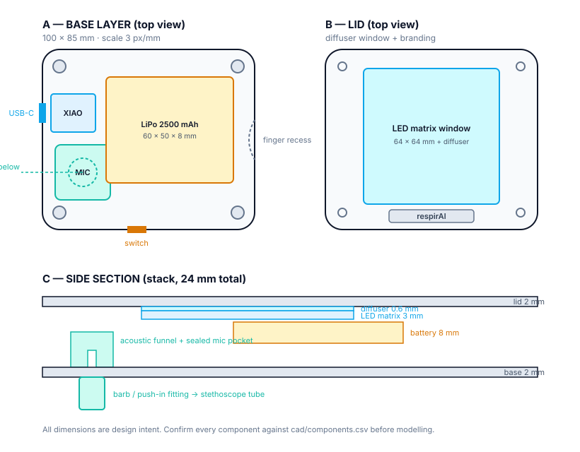

# respirAI — Enclosure Blueprint (v2, breath-only)

**Purpose:** mechanical design manual for the 3D-printed housing.
**Scope:** breathing analysis only. No ECG, no pulse oximeter. See §8 for what changes if they come back.

> All dimensions below are **design intent**. Nothing gets modelled until every component has been measured with calipers and written into `cad/components.csv`.

---

## 1. Form and ergonomics

A rounded "puck" held in the left hand. The base rests in the palm, the index finger settles into a concave recess on the right side, and the luminous top face points at the patient's eyes. The right hand holds the stethoscope bell, which connects to the base by the rubber tube.

**Target outer size: 100 × 85 × 24 mm**, corner radius 8 mm.

This is bigger than a mouse, and that's driven by two fixed parts: the LED matrix is 64 × 64 mm and the battery is 60 × 50 × 8 mm. They do not shrink, so the case doesn't either. Make it look deliberate — generous corner radii, a continuous side profile and a large glowing top face read as a designed object rather than an oversized box.

---

## 2. Internal layout

Positions in mm, measured from the bottom-left corner of the base as seen from above:

| Component | X | Y | Notes |
|---|---|---|---|
| Acoustic chamber + mic pocket | 6 – 32 | 14 – 40 | barb exits the base directly beneath |
| XIAO ESP32-S3 | 4 – 25 | 46 – 64 | USB-C faces the left wall |
| LiPo 2500 mAh | 30 – 90 | 22 – 72 | walled compartment, no boards beneath |
| Screw bosses (4×) | 8 / 92 | 8 / 77 | Ø6 mm outer, M3 |
| Switch slot | 40 – 49 | front wall | actuator opening 6 × 3 mm |
| LED matrix (in lid) | centred | 12 – 76 | 64 × 64 mm |

**Vertical stack:** base 2 mm → acoustic chamber 12 mm (its own column) → battery 8 mm → matrix 3 mm → diffuser 0.6 mm → lid 2 mm. The chamber sits beside the battery, not under it, so it does not add to the total height.

---

## 3. External features

### 3.1 Top face
- **Diffuser window:** 64 × 64 mm opening with a 2 mm lip all round for the diffuser panel to sit on. The panel is printed separately, 0.4–0.6 mm thick, in white or natural filament.
- **Branding recess:** 0.5 mm deep, **beside the diffuser, not under it** — a 40 × 8 mm strip along the front edge. Fill with paint or a cut sticker.

### 3.2 Base
- **Acoustic connection:** the barb for the stethoscope tube, centred under the acoustic chamber. See §4.1 — this part needs special attention.
- **Sticker recess:** 0.2 mm deep, 40 × 40 mm, for the printed lung decal. The recess protects it from rubbing against surfaces.
- **Four rubber feet pads** (optional): 1 mm recesses at the corners, so the device doesn't slide on a table.

### 3.3 Sides
- **Left wall:** USB-C cutout aligned with the XIAO. Nominal opening **9 × 3.5 mm**, plus 0.4 mm tolerance all round. Add a 1 mm chamfer so a chunky cable housing still seats.
- **Front wall:** slide-switch slot. The switch body is 8.6 × 4.3 × 4 mm; the visible slot is 6 × 3 mm with the body held internally.
- **Right wall:** concave finger recess, depth 4 mm, radius ~40 mm. **No hole** — it's purely ergonomic in this version.
- **Rear wall:** blank. Keep it clean.

---

## 4. Internal structures

### 4.1 Acoustic chamber (the critical part)

A funnel from the barb narrowing to the microphone port. Two rules:

1. **Keep the air volume small.** A short, narrow path preserves the high frequencies where crackles and wheezes live. Target an internal path of 15 mm or less from base to mic face.
2. **The mic gets a sealed pocket, not just a gasket.** A flat bed sized to the INMP441 board, with walls on all four sides and a closed back. If the mic's rear is open to the case interior, it will pick up wire rattle, LED matrix buzz and every finger tap on the housing. Seal the front with a silicone O-ring or a hot-glue bead; pack the back with foam.

**The barb will break if printed naively.** A barb printed standing up on the base has layer lines running perpendicular to the direction the tube gets pulled, which is the weakest possible orientation. Choose one:

- **Preferred:** model a plain Ø8 mm hole and glue in a real pneumatic push-in fitting (a few lei at any hardware shop). Strongest, most airtight, looks professional.
- **Alternative:** print the barb as a separate part lying on its side, with a 3 mm fillet at the flange, and screw or glue it to the base.
- **Avoid:** printing it integral and vertical.

Add a **strain-relief clamp** just inside the base — a small bridge the tube passes under — so the pull goes into the housing, never into the barb or the mic seal.

### 4.2 Mounting

| Item | Method |
|---|---|
| XIAO | Two guide rails plus a retaining clip, so USB-C insertion force goes into the housing. Do not rely on the case lid pressing it down. |
| Battery | Walled compartment, 1.5 mm walls, 0.5 mm clearance on each side, with a foam pad underneath. Keeps it away from sharp header pins. |
| LED matrix | Four small posts in the lid plus a retaining lip; or double-sided tape to the lid underside if the posts prove fiddly. |
| Lid | **Four M3 screws** into the base bosses. Use M3 heat-set brass inserts if you have a soldering iron with a spare tip; otherwise self-tapping into a Ø2.5 mm pilot hole. |

**Why screws, not snap-fits:** snap-fits need two or three test prints to tune the interference, and you have neither the time nor the print budget for that. Screws work on the first print.

### 4.3 Cable management
- A routing channel along the rear wall for the mic's five wires, keeping them clear of the battery.
- Two small cable posts to loop the battery leads around, so a tug never reaches the solder joints on the XIAO's BAT pads.
- Keep the LED matrix's power wires away from the mic wires where possible; the matrix draws current in sharp pulses.

---

## 5. Print settings

| Setting | Value |
|---|---|
| Material | **PLA** |
| Layer height | 0.2 mm |
| Perimeters | 3 (≈1.2 mm) |
| Infill | 20 % |
| Supports | Only under the USB-C and switch openings |
| Orientation | Base printed open-side up; lid printed outer-face down on a smooth sheet |

**PLA, not PETG.** PETG is the right pick when you need flexible snap-fits. With screws you don't, and PLA holds finer detail and is more forgiving for a print service to get right first time.

**Diffuser panel:** printed separately in white or natural PLA, 0.4–0.6 mm thick, 100 % infill, no supports, on a smooth build sheet. Print two — they're a few grams each, and one will warp.

---

## 6. Print plan and budget

At roughly 0.50 lei/gram locally, the whole case is 30–40 lei per round.

1. **Week 1 — test print:** the acoustic chamber section alone, a few grams. Tests the seal and the tube fit before anything else is committed.
2. **Week 3 — v1:** full base + lid + two diffusers.
3. **Week 4 — v2:** fixes only. Budget for this; every first enclosure has something wrong.

Order v1 **at least 10 days before the demo.**

---

## 7. Pre-print checklist

- [ ] Every component measured with calipers, written into `cad/components.csv`
- [ ] XIAO's USB-C position measured **as mounted**, not from the datasheet
- [ ] Battery measured including its wires and heat-shrink, not just the cell
- [ ] Acoustic seal tested on the week-1 test print
- [ ] Tube outer diameter measured — the bore of a cheap stethoscope tube varies
- [ ] Screw bosses checked against the actual M3 screws you own
- [ ] The breadboard version still works and stays assembled as backup

---

## 8. Add-ons (future extensions)

ECG and pulse oximetry are **extensions**, not part of this version. The core product is breathing analysis; these are modules that plug into the same platform later.

Do **not** cut holes for an add-on that isn't built yet — an empty rectangular hole looks unfinished, while a blank finger recess looks intentional.

If an extension is working before the case is frozen:

- **ECG add-on (AD8232):** a Ø6.5 mm hole in the right wall for the 3.5 mm jack, plus two M3 standoffs for the board. The jack needs mechanical support; plug force will otherwise rip it off.
- **Pulse add-on (MAX30102):** a 12 × 8 mm window in the centre of the finger recess, with the sensor face flush to the surface — a recessed sensor reads badly.

Keep each as a separate lid/base variant in CAD so the breath-only version stays clean.
